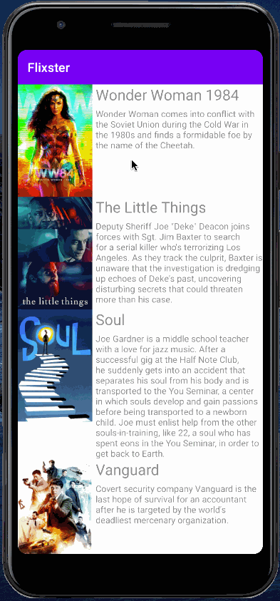

## Flixster 
Flix is an app that allows users to browse movies from the [The Movie Database API](http://docs.themoviedb.apiary.io/#).

---

### REQUIRED 
- [X] User can view a list of movies (title, poster image, and overview) currently playing in theaters from the Movie Database API.

### BONUS
- [X] Views should be responsive for both landscape/portrait mode.
   - [X] In portrait mode, the poster image, title, and movie overview is shown.
   - [X] In landscape mode, the rotated alternate layout should use the backdrop image instead and show the title and movie overview to the right of it.

### App Walkthough GIF
 

#### Open-source libraries used
- [Android Async HTTP](https://github.com/codepath/CPAsyncHttpClient) - Simple asynchronous HTTP requests with JSON parsing
- [Glide](https://github.com/bumptech/glide) - Image loading and caching library for Androids

© Copyright 2021 Fodé Diop - MIT
